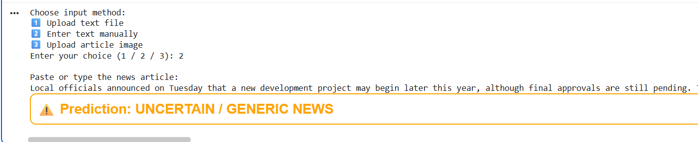

# 📰 Fake News Detection System using Machine Learning

A Machine Learning project that detects whether a news article is REAL or FAKE using Natural Language Processing (NLP) and Logistic Regression.

This project uses the Fake and Real News Dataset from Kaggle and includes:

- Text preprocessing
- TF-IDF vectorization
- Logistic Regression classifier
- Accuracy & evaluation metrics
- Data visualization
- Confusion matrix
- Important word visualization
- OCR support for image-based news articles
- Model saving using Joblib

## 📂 Dataset

Dataset used:
Fake and Real News Dataset  
Source: Kaggle  
Link:
https://www.kaggle.com/datasets/clmentbisaillon/fake-and-real-news-dataset

The dataset contains:
- True.csv → Real news articles
- Fake.csv → Fake news articles

## 🚀 Features

✅ Data Cleaning (Stopwords removal, regex cleaning)  
✅ TF-IDF Vectorization (Unigrams + Bigrams)  
✅ Logistic Regression Model  
✅ Stratified Train-Test Split  
✅ Model Accuracy Calculation  
✅ Classification Report  
✅ Confusion Matrix Visualization  
✅ Important Word Analysis  
✅ OCR Support (Image to Text using Tesseract)  
✅ Model Saving (fake_news_model.pkl)  

## 🛠️ Technologies Used

- Python
- Pandas
- NumPy
- NLTK
- Scikit-learn
- Matplotlib
- Seaborn
- Joblib
- Pytesseract
- Google Colab

## 📊 Data Visualization

The project includes:

- Distribution of Real vs Fake news
- Confusion Matrix heatmap
- Top words indicating Real news
- Top words indicating Fake news

## 📈 Model Performance

The model uses:
- TF-IDF Vectorizer
- Logistic Regression

Typical Accuracy Achieved:
94% – 98% accuracy (depending on parameters)

Evaluation Metrics Included:
- Accuracy Score
- Precision
- Recall
- F1-Score
- Confusion Matrix

## 🧠 How It Works

1. Load dataset
2. Clean text data
3. Remove stopwords
4. Convert text into TF-IDF features
5. Train Logistic Regression model
6. Evaluate performance
7. Save trained model
8. Predict new news articles

## 🖼️ OCR Support (Image News Detection)

The system can:
- Upload an image
- Extract text using Tesseract OCR
- Predict if the extracted article is Real or Fake

## 💾 Model Saving

The trained model is saved as:

fake_news_model.pkl

It contains:
- TF-IDF Vectorizer
- Logistic Regression model

## ▶️ How to Run

1️⃣ Clone the repository

git clone https://github.com/your-username/your-repo-name.git  
cd your-repo-name

2️⃣ Install dependencies

pip install pandas numpy scikit-learn nltk matplotlib seaborn joblib pytesseract pillow kagglehub

3️⃣ Download dataset

Use KaggleHub inside the notebook:

import kagglehub  
path = kagglehub.dataset_download("clmentbisaillon/fake-and-real-news-dataset")

4️⃣ Run the notebook

Open:  
FAKE.ipynb  

Run all cells.

# 📸 Sample Outputs

## 🔹 1️⃣ Input Method Selection

The system allows three input methods:
- Upload text file
- Enter text manually
- Upload article image
![input method selection].(images/1.png).

---

## 🔹 2️⃣ Real News Prediction (Text File Upload)

When uploading a real news article:

✅ Prediction: REAL NEWS

---

## 🔹 3️⃣ Manual Text Input (Uncertain / Generic News)

When the content is too short or generic:

⚠️ Prediction: UNCERTAIN / GENERIC NEWS

---

## 🔹 4️⃣ Image Upload with OCR (Fake News)

When uploading a fake news image:
- Text is extracted using OCR
- The model predicts FAKE NEWS

❌ Prediction: FAKE NEWS

## 📌 Project Structure

├── FAKE.ipynb  
├── fake_news_model.pkl  
├── 1.png  
├── 2.png  
├── 3.png  
├── 4.png  
├── README.md  

## 🎯 Future Improvements

- Deploy as Streamlit Web App
- Add Deep Learning (LSTM / BERT)
- Add Web Scraping for live news
- Improve UI
- Deploy on cloud

## 👨‍💻 Author

Your Name  
Student Project

## ⭐ If You Like This Project

Give this repository a ⭐ on GitHub!
